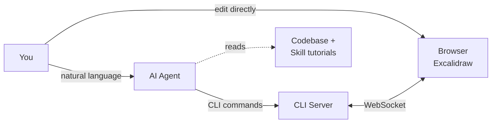
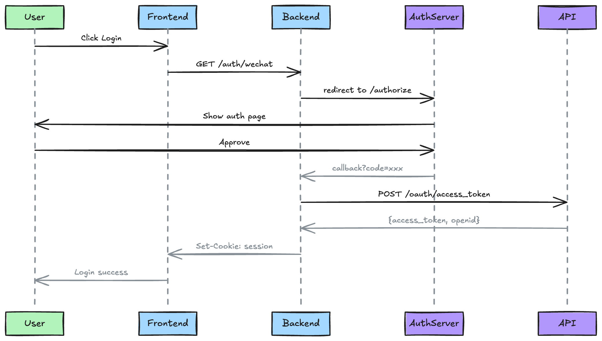
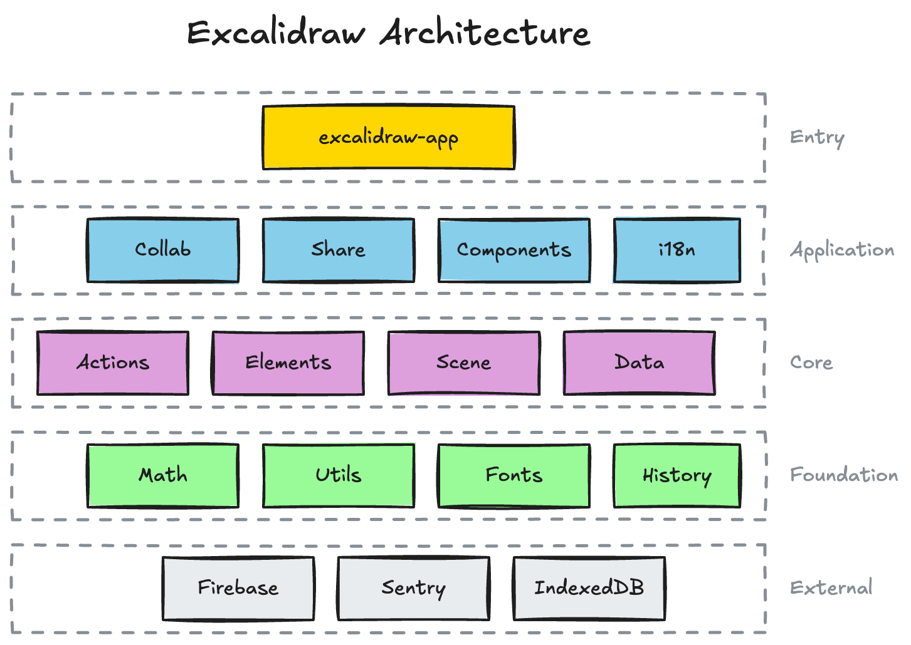
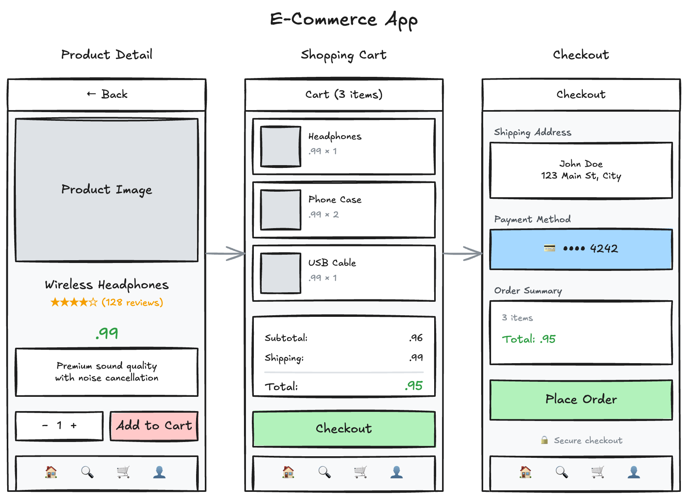

# Agent Canvas

An AI agent skill for drawing diagrams, flowcharts, and visualizations on Excalidraw.

## Features

🔌 **Works with any AI agent** — Claude Code, Codex, Cursor, or any agent that supports skills.

🧠 **Context-aware** — Unlike web-based drawing tools, your agent sees your entire codebase. Ask it to "draw the architecture of this project" and it will analyze your code structure to generate accurate diagrams.

⚡ **Token efficient** — CLI commands instead of generating `.excalidraw` JSON (thousands of tokens per element):

```bash
# JSON approach: 500+ tokens per shape
# CLI approach: ~50 tokens
agent-canvas add-shape -t rectangle -x 100 -y 100 -l "Hello"
```

🔄 **Real-time & iterative** — See changes instantly in browser. Refine diagrams through natural conversation: *"make the boxes blue"*, *"add a database layer"*.

👀 **Bidirectional** — Agent can export and view the canvas anytime. Make manual edits in Excalidraw, then ask the agent to continue — no screenshots needed.

📦 **Easy setup** — Skill automatically installs and updates the CLI. Just start drawing.

🧩 **Extensible** — Add custom drawing tutorials in `references/` to teach your agent domain-specific diagram styles.

## Installation

```bash
npx add-skill WHQ25/agent-canvas --skill agent-canvas
```

This installs the skill to your AI coding agent (Claude Code, Codex, Cursor, etc.).

After installation, just ask your agent to draw something:
- "Draw a flowchart for user authentication"
- "Create an architecture diagram for a microservices system"
- "Sketch a mind map for project planning"

## How It Works

1. `agent-canvas start` opens a local Excalidraw canvas in your browser
2. CLI sends drawing commands via WebSocket, canvas updates in real-time
3. You and your agent collaborate on the same canvas



## Examples

### Sequence Diagram

**Prompt:**
> Draw a sequence diagram for WeChat OAuth login flow

**Output:**



### Flowchart with Iterative Refinement

**Prompt 1:**
> Draw a flowchart for the add-text command processing flow

**Prompt 2 (refining):**
> Show all 9 anchor types in a grid, use dashed rectangle to group them

**Output:**


### Architecture Diagram

**Prompt:**
> Draw an architecture diagram for the Excalidraw project based on its codebase structure

**Output:**



### UI Mockup

**Prompt:**
> Design an e-commerce app with product detail, shopping cart, and checkout pages

**Output:**



## CLI Installation

The skill will guide the agent to install the CLI automatically. You can also install it manually:

```bash
npm install -g @agent-canvas/cli
```

## Contributing

Contributions are welcome!

The skill is located in `skills/agent-canvas/`:

- `SKILL.md` - CLI command reference (how to use each command)
- `references/` - Drawing tutorials for specific diagram types (flowcharts, UI mockups, etc.)

**How to contribute:**

1. Add new drawing tutorials to `skills/agent-canvas/references/`
2. Improve the CLI tool in `packages/cli/`
3. Report issues or suggest features

## Development

```bash
# Install dependencies
bun install

# Build all packages
bun run build

# Run in dev mode (starts both web-app and CLI server)
bun run dev

# Run CLI commands during development
bun dev:cli <command>
# Example: bun dev:cli start
# Example: bun dev:cli add-shape -t rectangle -x 100 -y 100
```